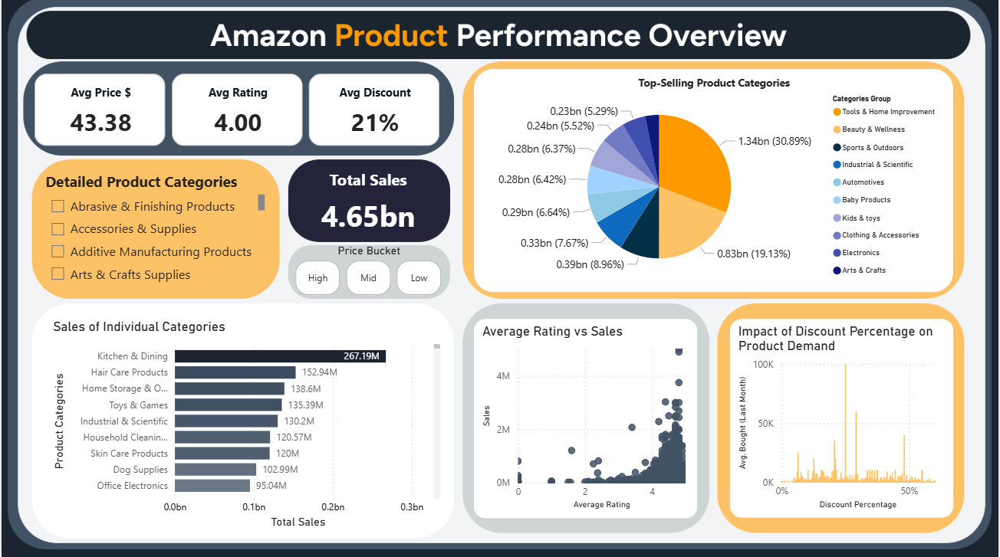
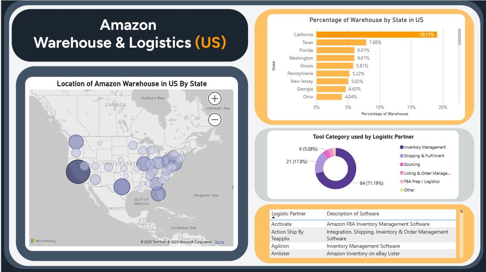
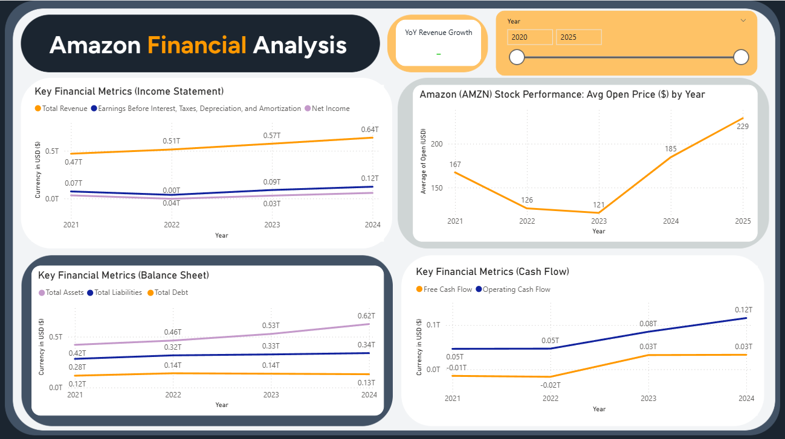
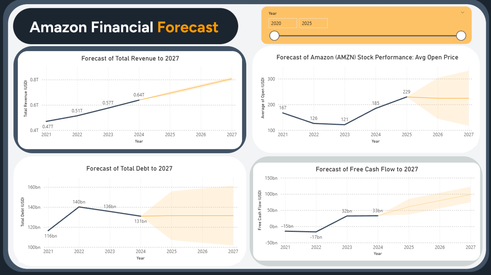
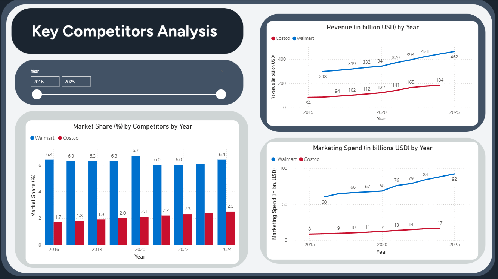

# Amazon Strategic Business Intelligence Analysis

## 📌 Project Overview

This project uses a hypothetical scenario inspired by Amazon's scale as a global e-commerce leader, exploring how a data-driven approach could improve decision-making, based on a publicly available Kaggle dataset. The goal is to generate actionable insights that enhance product sales, optimize financial strategies, identify logistics expansion opportunities, and assess market positioning against competitors.

---

## 🎯 Key Objectives
*   **Product Strategies:** Identify product categories, price ranges, ratings, and discount levels associated with stronger sales performance.
*   **Financial Health & Forecasting:** Evaluate income statements, cash flows, and balance sheets to reveal strategic insights for future direction.
*   **Supply Chain Optimization:** Analyse the geographic distribution of FBA warehouses to identify potential gaps and expansion opportunities.
*   **Competitive Benchmarking:** Assess threats from direct competitors by examining past revenue, marketing spend, and e-commerce market share.

---

## 📊 Interactive Dashboards
This project features five interactive Power BI dashboards designed to facilitate drill-down analysis and high-level strategic oversight.

### **1. Product Performance Overview**
Identify the product categories, price ranges, ratings, and discount levels associated with stronger sales performance.

### **2. Warehouse & Logistics (US)**
Analyse the geographic distribution of Amazon FBA warehouses and identify potential gaps for network expansion.

### **3. Financial Analysis**
Evaluate Amazon's historical revenue, profitability, assets, debt, and cash-flow trends from 2021–2024.

### **4. Financial Forecast**
Forecast revenue, free cash flow, debt, and stock price using Power BI's Exponential Smoothing (ETS) models.

### **5. Competitors Benchmarking**
Benchmark Amazon against Walmart and Costco using revenue, marketing expenditure, and market-share indicators.

---
## 🔍 Key Findings

### 1. Product Performance
- Analysis of 1.4 million products shows that **Tools & Home Improvement** generated the highest observed sales at **$1.34B (30.89%)**, followed by **Beauty & Wellness at $0.83B (19.13%)**.
- Products priced below **$50 accounted for $3.31B** of total observed sales.
- Products rated above **4 stars** generally recorded stronger sales, while **25–29% discount levels** had the highest average units bought.
- **Business implication:** Prioritize high-performing categories and lower-price products in inventory and promotional planning.

### 2. Warehouse & Logistics
- The US FBA network is concentrated in **California (194 centres; 19%)**, followed by **Texas (80; 7.88%)** and **Florida (61; 6.01%)**.
- The warehouse map identifies relatively limited coverage in **Idaho, Iowa, and Arkansas**, highlighting potential locations for further network evaluation.
- Different logistics partners use different management systems, indicating an opportunity for greater data and system standardization.
- **Business implication:** Evaluate geographic gaps and logistics-system integration to improve network coverage, resilience, and operational visibility.

### 3. Financial Analysis & Forecasting
- From **2021–2024**, Amazon recorded growth in **revenue, net income, assets, and cash flow**, while total debt declined.
- ETS forecasting projects approximately **8% year-over-year revenue growth** and **free cash flow reaching $98B by 2027**.
- Total debt is forecast at approximately **$131B**, with a wider confidence interval indicating greater uncertainty.
- **Business implication:** Use projected revenue and cash-flow growth to inform long-term investment planning while accounting for forecast uncertainty.

### 4. Competitive Analysis
- Walmart's reported e-commerce market share remained approximately **6%** over the five-year period, while Costco increased from **1.7% to 2.5%**.
- Amazon remained substantially larger in reported e-commerce market share, although Walmart and Costco showed significant marketing expenditure.
- **Business implication:** Continue monitoring competitor market-share growth and marketing investment to assess emerging competitive pressure.

---
## 💡 Actionable Recommendations

1. **Product & Inventory Strategy:** Prioritize inventory planning for **Tools & Home Improvement** and **Beauty & Wellness**, which recorded the highest observed sales.

2. **Warehouse Expansion:** Evaluate **Idaho, Iowa, and Arkansas** as potential FBA expansion locations based on identified geographic coverage gaps.

3. **Logistics Integration:** Explore standardized data and system integration across logistics partners to improve operational consistency and visibility.

4. **Financial Planning:** Use projected revenue and free cash flow growth to inform potential **R&D and expansion investments**, while incorporating forecast uncertainty into risk planning.

---
## 🛠️ Technology Stack & Methodology
*   **Data Collection:** Python (Google Colab) used for direct downloads and web scraping from Yahoo Finance.
*   **Data Preprocessing:** Python and Power Query for cleaning, handling missing values, removing duplicates, data transformation and feature engineering.
*   **Visualization:** Microsoft Power BI for interactive dashboards utilizing bar charts, scatter plots, and bubble maps.
*   **Advanced Analytics:** Power BI’s built-in **Exponential Smoothing (ETS)** models to project total revenue, debt, and cash flow.

## 🔗 Data Sources

*   **Product Data:** [Amazon Products Dataset 2023 (1.4M Products)](https://www.kaggle.com/datasets/asaniczka/amazon-products-dataset-2023-1-4m-products) 
*   **Logistics Data:** [Amazon FBA Location Master List](https://www.linkedin.com/posts/blairforrest_every-amazon-warehouse-location-in-one-database-activity-7331393454024884226-Iqhu/)
*   **Stock Data:** [Amazon Stocks 2025](https://www.kaggle.com/datasets/meharshanali/amazon-stocks-2025) 
*   **Financial Reports:** [Amazon (AMZN) Financials](https://finance.yahoo.com/quote/AMZN/financials/) via Yahoo Finance 
*   **Competitor Data:** [Walmart and Costco Market Data](https://www.kaggle.com/datasets/abdulkkhayyum519/walmart-and-costco-revenue-marketing-and-market-share) 

> **Note on Data Access**: The original dataset is not included in this repository. Please obtain the dataset from the original source.
